# Visualising RNA-seq using R

This tutorial will show you some of the elementary skills you need to begin visualising RNA-seq
data (specifically, abundance estimates for gene RNA transcripts) in R. To do so, we will use a
publicly available data set generated by the Genotype-Tissue Expression (GTEx) consortium.

## The GTEx RNA-seq dataset

The GTEx consortium is an ongoing project which has collected tissue material from over 1,000
individuals. This material has been used to generate RNA-sequencing data and study patterns of gene
activity across different organs in the human body. For more detailed information on how the GTEx
data was generated, you can refer to their [online portal](https://gtexportal.org/home/).

For the purposes of this tutorial, you will be working with a previously processed and cleaned file
containing gene expression measurements for different tissues. The measurements in this file
represent an average profile, generated by computing the mean expression of each gene across all
individuals in the cohort. Furthermore, the course organisers cleaned this data set by removing any
unannotated genes or any genes which were too lowly expressed to be of interest for this tutorial.
Measurements were normalised to account for systematic differences between batches, and expression
values are presented as Transcripts per Million (TPM). For more information on why normalisation is
needed and how it is performed, you can refer to the accompanying slides.

## Loading libraries

We'll begin by loading a series of R libraries containing useful functions for data visualisation. If you have not yet installed these libraries, you can do so by running the following code:


```r
install.packages("tidyverse")
install.packages("matrixStats")
install.packages("reshape2")
install.packages("pheatmap")
install.packages("ggpubr")
install.packages("ggrepel")
install.packages("hexbin")
```

Let's now load the libraries.


```r
library(tidyverse)
library(matrixStats)
library(reshape2)
library(pheatmap)
library(ggpubr)
library(ggrepel)
library(hexbin)
```

## Loading data

We will now load the GTEx gene expression table, as well as a table containing annotations for each of the genes measured in the study. These files are in tab-separated value (TSV) format, which means they are composed of columns, separated by tabular spaces. You can read this type of file into R by using the read.table() function, as specified below:


```r
gtex <- read.table("../Data/GTEx-v8-RNAseq_mean-TPM_QCed.tsv", sep = "\t", header=T, row.names=1)
gene_annotations <- read.table("../Data/GTEx_gene-annotations.tsv", sep = "\t", header=T, row.names=1)
```

Let's now have a closer look at this expression table by previewing the first 10 rows and columns. Note how each row corresponds to a gene and each column corresponds to a tissue. Entries in the table contain the expression levels of each gene in each tissue in TPM units.


```r
gtex[1:10,1:10]
```

```
##           Adipose_Subcutaneous Adipose_Visceral_Omentum Adrenal_Gland
## LINC01128             7.441180                 7.797220       4.03224
## LINC00115             4.490250                 3.424820       2.75144
## SAMD11                0.476230                 2.931190       3.78499
## NOC2L                52.861400                48.187700      37.17370
## KLHL17                9.678200                 8.967750       7.89155
## PLEKHN1               0.559729                 0.648233       1.92579
## HES4                 21.789300                24.187600       2.91384
## ISG15                36.599900                35.009300      13.45140
## AGRN                 18.538800                21.475700       4.78231
## C1orf159              9.295820                 6.112750       5.07871
##           Artery_Aorta Artery_Coronary Artery_Tibial  Bladder Brain_Amygdala
## LINC01128     8.845420        8.720360     11.097400  7.62418       2.977490
## LINC00115     6.225130        5.935010      7.817070  7.57255       1.453660
## SAMD11        5.717060        3.104580      7.931910 19.05830       0.532897
## NOC2L        55.491600       51.901500     62.564000 71.86850      18.344900
## KLHL17       13.917400       13.392400     10.740400 17.60890       3.048490
## PLEKHN1       0.744398        0.868276      0.717782  4.22114       0.107346
## HES4         46.628900       64.610400     98.388500 33.05170      16.737000
## ISG15        50.760100       43.741600     50.375500 32.98460      43.609600
## AGRN         25.299100       25.774100     22.740600 20.00260      18.847400
## C1orf159      7.598480        8.150340      7.573130 10.28930       5.512330
##           Brain_Anterior_cingulate_cortex_BA24 Brain_Caudate_basal_ganglia
## LINC01128                             4.992650                    3.862590
## LINC00115                             1.423120                    2.043400
## SAMD11                                0.466223                    2.217410
## NOC2L                                27.560400                   25.096000
## KLHL17                                5.058480                    4.410430
## PLEKHN1                               0.100712                    0.121139
## HES4                                 20.636600                   31.458800
## ISG15                                25.535200                   27.367600
## AGRN                                 22.643900                   19.735000
## C1orf159                              6.878150                    6.623100
```

Let's now look at the first rows in the gene annotations table. You'll notice that this table contains information pertaining each gene, such as its name, unique ID, genomic location (chromosome, start position, and end position), and its gene family.


```r
head(gene_annotations)
```

```
##                   gene_id gene_symbol chr  start    end        biotype
## LINC01128 ENSG00000228794   LINC01128   1 825138 859446         lncRNA
## LINC00115 ENSG00000225880   LINC00115   1 826206 827522         lncRNA
## SAMD11    ENSG00000187634      SAMD11   1 923923 944575 protein_coding
## NOC2L     ENSG00000188976       NOC2L   1 944203 959309 protein_coding
## KLHL17    ENSG00000187961      KLHL17   1 960584 965719 protein_coding
## PLEKHN1   ENSG00000187583     PLEKHN1   1 966482 975865 protein_coding
```

We are now ready to start exploring this data set.

## Data visualisation

Visualisation is usually the first step when exploring a data set, since it enables us to assess data quality and identify any major patterns. Which techniques and types of graphs we use for visualisation is determined by the nature of our data. For example, how many variables do we have? What are we interested in assessing?

In this tutorial, we will begin by visualising a single variable, and then gradually incorporate more variables into our exploratory analysis.

### Univariate data

The most simple visualisation task is plotting a single variable. This falls under the umbrella term of univariate data analysis. Here, we will use univariate data visualisation to illustrate one of the most important steps in RNA-seq data analysis: data transformations.

Let's start by assessing how high the expression of each gene is on average across all tissues. To do so, we use the `rowMeans()` function and apply to the GTEx data. This function will take each row of the expression table (which, as we have seen, corresponds to a gene) and its average value across all columns. Thus, will give us the mean expression of each gene in the study.

We save these results into a new variable called `mean_expression`, which also contains the name and family of each gene.


```r
mean_expression <- data.frame(
  gene_name = rownames(gtex),
  biotype = gene_annotations$biotype,
  mean_TPM = rowMeans(gtex)
)
```

#### Data transformations

For a quick visualisation of this variable, we can use the `hist()` function to generate a histogram. This histogram shows us the distribution of gene expression values in our study:


```r
hist(mean_expression$mean_TPM, breaks=100, xlab = "Mean expression across tissues (TPM)", main="Gene expression distribution")
```

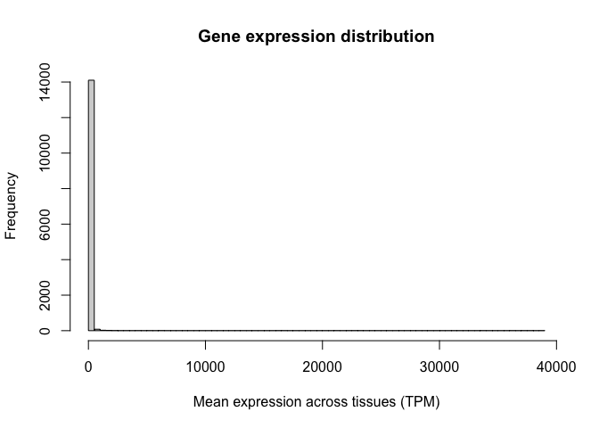<!-- -->

Note the oddness of this histogram: it seems like the vast majority of values are close to zero, while a few genes have expression values as high as 30,000 TPM. In situations like this, we say the variable spans a **dynamic range**. In other words, some values are tiny and some are huge, and the increases are not necessarily linear. RNA-seq counts are always distributed in this way.

To circumvent this problem, we use a **data transformation** to make this variable behave more linearly. For example, we can take the logarithm of the GTEx expression values, as follows:


```r
gtex_log <- log10(gtex+1)
```

Let's now calculate the average log-TPM value for each gene and add it as a new column in our "mean_expression" variable:


```r
mean_expression$log_mean_TPM <- rowMeans(gtex_log)
```

Because of the way logarithms are defined, now genes with values of 10, 100, or 1000 TPM, which used to be very far away from each other, have closer (they would be 1,2, and 3 in the log scale).

Let's generate a histogram for this new variable. Note how we now have a distribution of values with central tendency (i.e. a clear peak).


```r
hist(mean_expression$log_mean_TPM, breaks=100, xlab = "Mean expression across tissues (TPM)", main="Gene expression distribution")
```

<!-- -->

Logarithms are the most common used transformation in RNA-seq data analysis, and expression values are almost always shown in log scale.

#### Histograms

Now that we have transformed our data in the way we want to, we can begin to explore how to use **ggplot**. The ggplot library is an extremely flexible group of functions which allows us to create plots that are personalised and fine-tuned, where we can specify each little detail we want to show.

Let's illustrate this by recreating the histograms shown above, but now using the ggplot package. For a review of the syntax required by ggplot, you can refer to the associated slides.

To construct a ggplot, we must specify the data set of interest (this should be a data.frame object, such as our "mean_expresssion" variable) and the variables we want to plot (in this case, the average log-TPM value for each gene). Next, we need to specify the type of visualisation that we want (here, a histrogram). We can add multiple visualisations one on top of the other, as layers, each of them being preceded by a '+' sign.

Let's create a simple histogram:


```r
ggplot(mean_expression, aes(x=log_mean_TPM)) +
  geom_histogram()
```

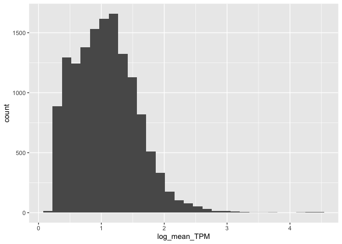<!-- -->

Once we have the basic elements of our plot in place, we can begin to modify the finer details of it. For example, we can specify how the X and Y axis should be labelled by adding (+) an X label (`xlab()`) and a Y label (`ylab()`) as two additional layers. We can also use this syntax to add a title at the top of our graph (`ggtitle()`):


```r
ggplot(mean_expression, aes(x=log_mean_TPM)) +
  geom_histogram() +
  xlab("Mean expression (log-TPM)") +
  ylab("Number of genes") +
  ggtitle("Gene expression distribution in GTEx")
```

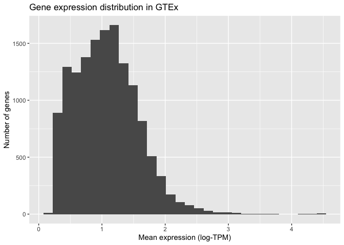<!-- -->

ggplot also allows us to specify how the histogram should be plotted. For instance, we can increase the number of bars shown to 100:


```r
ggplot(mean_expression, aes(x=log_mean_TPM)) +
  geom_histogram(bins = 100) +
  xlab("Mean expression (log-TPM)") +
  ylab("Number of genes") +
  ggtitle("Gene expression distribution in GTEx")
```

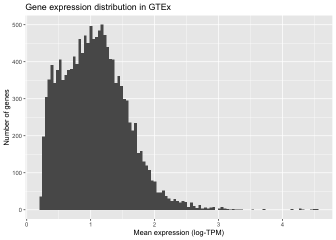<!-- -->

Finally, we can modify the visual elements of our plot, such as backgrounds, colours, text sizes, text alignments, etc... to our liking. We do this by specifying a theme and thematic elements. For example, by using `theme_bw()` we are telling ggplot to use a theme with a white background instead of the default grey backround:


```r
ggplot(mean_expression, aes(x=log_mean_TPM)) +
  geom_histogram(bins = 100) +
  xlab("Mean expression (log-TPM)") +
  ylab("Number of genes") +
  ggtitle("Gene expression distribution in GTEx") +
  theme_bw()
```

<!-- -->

Finally, we can specify more detailed characteristics inside the `theme()` function. For example, we can align the title to the centre of the plot or reduce the number of lines shown in the plot grid:


```r
ggplot(mean_expression, aes(x=log_mean_TPM)) +
  geom_histogram(bins = 100) +
  xlab("Mean expression (log-TPM)") +
  ylab("Number of genes") +
  ggtitle("Gene expression distribution in GTEx") +
  theme_bw() +
  theme(plot.title =  element_text(hjust=0.5, size=16),
        panel.grid.minor = element_blank())
```

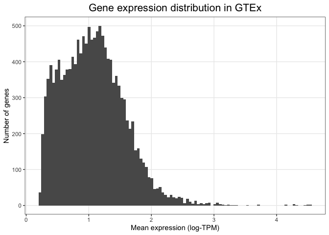<!-- -->

By adding one layer at a time and specifying individual visual elements, ggplot allows us to create custom made plots that fulfill all our visual needs.

### Bivariate data

Let's now turn our attention to situations where we don't just have one, but two variables. Most often, we are interested in assessing how these two variables relate to one another. This can be achieved by creating bivariate plots.

Bivariate data can contain a combination of qualitative and quantitative variables. Let's look at these combinations one at a time.

#### Quantitative variable vs qualitative variable

Sometimes we are interested in understanding how a quantitative variable compares between several levels or groups of a qualitative variable. For example, are protein-coding genes and non-coding RNAs expressed at the same level?

##### Boxplots

A widely used tool for assessing this question is the box plot. Box plot summarise the data by creating a box which contains the majority of the data points (more specifically, a box that represents the interquartile range). A line is used to indicate the average (median) value, and whiskers extend outside the box to indicate the full range of the data. Individual dots are added to represent points that are very far away from the average value. Let's use boxplots to compare the average expression level of coding and non-coding genes.

To do so, we use ggplot. Note how we are asking ggplot to represent the gene family variable (i.e. coding vs non-coding) in the X axis and the average expression level (log-TPM) in the Y variable. We are also specifying that we want our main layer to be a box plot:


```r
ggplot(mean_expression, aes(x=biotype, y=log_mean_TPM)) +
  geom_boxplot() +
  ylab("Mean expression (log-TPM)") +
  xlab("Gene type") +
  ggtitle("Gene expression distribution in GTEx") +
  theme_bw() +
  theme(plot.title =  element_text(hjust=0.5, size=16),
        panel.grid.major = element_blank())
```

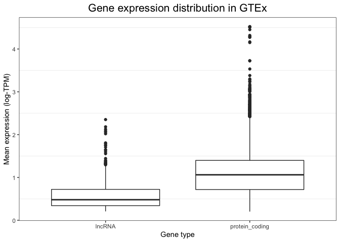<!-- -->

While a plot on its own is not enough to draw any conclusions (we would need a statistical test), this visualisation alone already suggests that non-coding RNAs could be expressed at a lower level compared to coding genes.

##### Violin plots

One important caveat of box plots is that they assume the data shows central tendency (i.e. that the distribution has a big peak or bell shape, and that the tails of this distribution are more or less symmetric around this peak). This is not always the case, and in cases when this requirement is not fulfilled, box plots are not appropriate.

An alternative is to use violin plots. Violin plots basically consist of histograms or density plots for each variable, which have been turned upside down and put side by side to each other. This allows us to compare groups to each other, but does not assume any specific requirements and instead allows us to see the full distribution of the variable.

We can create violin plots in ggplot as follows. Note how the syntax is extremely similar to the box plot (only one line of code changes):


```r
ggplot(mean_expression, aes(x=biotype, y=log_mean_TPM)) +
  geom_violin() +
  ylab("Mean expression (log-TPM)") +
  xlab("Gene type") +
  ggtitle("Gene expression distribution in GTEx") +
  theme_bw() +
  theme(plot.title =  element_text(hjust=0.5, size=16),
        panel.grid.major = element_blank())
```

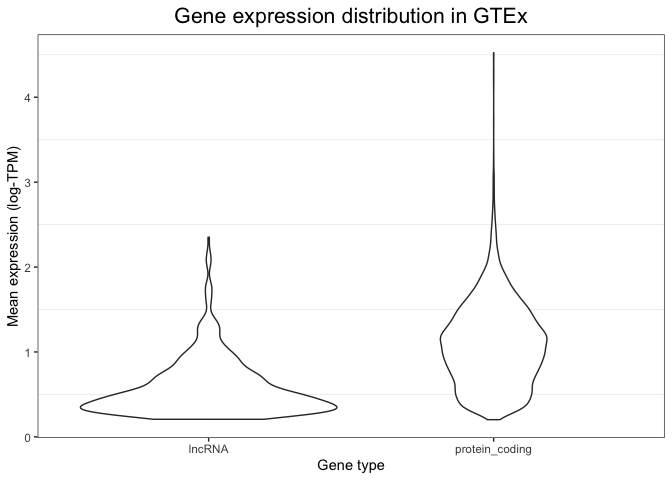<!-- -->

Because of the flexibility of ggplot, it is even possible to combine these two types of visualisations into a single plot. We can do this by first drawing a violin plot (this is set as the first layer of our plot), and then adding on top of it a boxplot (which is overlaid as a second layer). The syntax to do this is shown below. Note how now we have extensive information: we can see the full distribution in the violin plot, but we also obtain summary variables (like the median value and the box edges) that can be easily compared between groups.


```r
ggplot(mean_expression, aes(x=biotype, y=log_mean_TPM)) +
  geom_violin() +
  geom_boxplot(width = 0.2) +
  ylab("Mean expression (log-TPM)") +
  xlab("Gene type") +
  ggtitle("Gene expression distribution in GTEx") +
  theme_bw() +
  theme(plot.title =  element_text(hjust=0.5, size=16),
        panel.grid.major = element_blank())
```

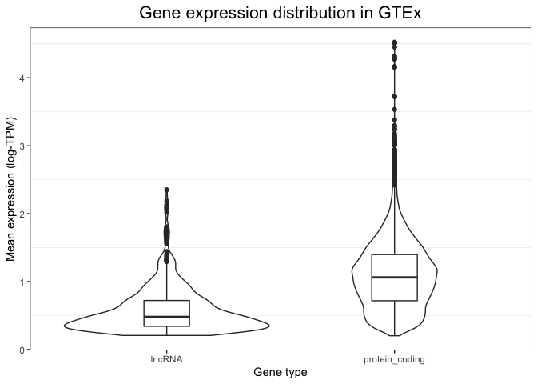<!-- -->

##### Bar plots

Bar plots are a useful alternative when we are comparing multiple groups or levels of a qualitative variable. They are reliable because they rely in representing quantities as lengths, and they are particularly useful when we only have one value per category. Let's look at some example bar plots by comparing the expression level of a few genes of interest across different tissues.

We will begin by reformatting the GTEx expression table so as to column containing tissue labels. This is necessary because we want to compare tissues to each other, and thus we need them to be in the form of a categorical variable. The "melt" function in the reshape2 library allows us to do easily modify our table as needed:


```r
gtex_log_reshaped <- gtex_log
gtex_log_reshaped$gene <- rownames(gtex_log_reshaped)
gtex_log_reshaped <- melt(gtex_log_reshaped)
colnames(gtex_log_reshaped) <- c("gene","tissue","log_TPM")
head(gtex_log_reshaped)
```

```
##        gene               tissue   log_TPM
## 1 LINC01128 Adipose_Subcutaneous 0.9264032
## 2 LINC00115 Adipose_Subcutaneous 0.7395921
## 3    SAMD11 Adipose_Subcutaneous 0.1691540
## 4     NOC2L Adipose_Subcutaneous 1.7312776
## 5    KLHL17 Adipose_Subcutaneous 1.0284981
## 6   PLEKHN1 Adipose_Subcutaneous 0.1930491
```

Note how tissues (which were previously represented as separate columns) have now been collapsed into a single column, with its adjacent label.

Now we are ready for visualising using ggplot. Let's start by inspecting the expression level of MYH7, a gene encoding the beta myosin heavy chain. We expect this gene to be specific to muscular tissue, since myosin is involved in muscle contraction.

We use ggplot to visualise gene expression values (log-TPM) across different tissues in a bar plot format, based on the code below. There are several details to note in this code. Firstly, note how we are not using the whole table: we subset it so that ggplot only sees the rows that correspond to MYH7. Secondly, note how we are not specifying the Y coordinate anymore. This is because we are no longer using the Y position as a plotting channel, instead we are using lengths, which are specified within with the "weight" parameter. Finally, note the "coord_flip" indication. This flips our axes, so that the X axis becomes the Y axis and vice versa. The only purpose of this line is to make the plot more readable, since having tissues in the X axis would result in them cramming and the labels being difficult to read.


```r
ggplot(gtex_log_reshaped[gtex_log_reshaped$gene=="MYH7",], aes(x=tissue)) +
  geom_bar(aes(weight=log_TPM)) +
  xlab("") +
  ylab("Gene expression (log-TPM)") +
  ggtitle("MYH7 expression") +
  coord_flip() +
  theme_bw() +
  theme(plot.title = element_text(hjust=0.5))
```

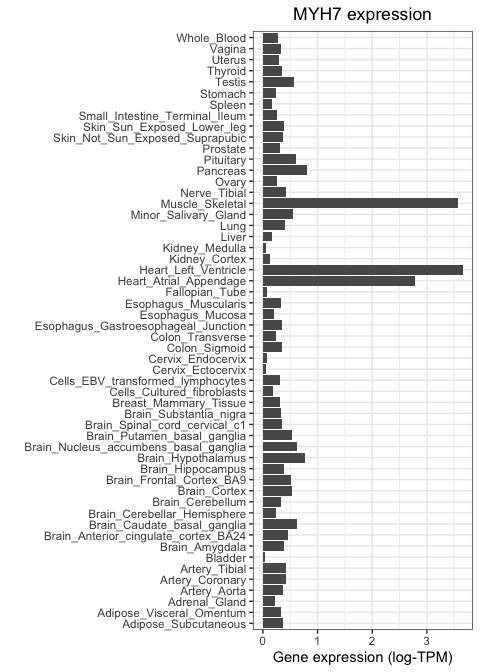<!-- -->

As expected, MYH7 is highly expressed in heart and skeletal muscle, but not in other tissue types.

Let's now repeat this, but using a neuronal marker. We will focus on SYP, which encodes the protien synaptophysin, known to be important for neuronal synapses. We use the same code as above, but changing our subsetting strategy so that only SYP values are fed to ggplot:


```r
ggplot(gtex_log_reshaped[gtex_log_reshaped$gene=="SYP",], aes(x=tissue)) +
  geom_bar(aes(weight=log_TPM)) +
  xlab("") +
  ylab("Gene expression (log-TPM)") +
  ggtitle("Synaptophysin expression") +
  coord_flip() +
  theme_bw() +
  theme(plot.title = element_text(hjust=0.5))
```

<!-- -->

Notice how this gene is highly expressed across all brain regions and in the pituitary, but shows much lower activity everywhere else.

#### Quantitative vs quantitative

Sometimes we are interested in comparing two quantitative variables to each other. For example, how similar are two tissues to each other in terms of their gene expression? Or, are two genes of interest similar or different in their expression pattern? We can answer these questions using scatter plots.

##### Scatter plots

As an example, let's compare two tissues to each other: subcutaneous adipose tissue and visceral omentum. Both of these tissues are mostly composed of adipocytes, so we would expect them to be very similar when it comes to their gene expression profiles. To test this, we can take the level of each gene in tissue 1 and visualise it against its level in tissue 2. We do this for each of the 14,000 genes in the GTEx study, where each gene is represented as a dot.

Scatter plots van be generated in ggplot by using the `geom_point()` function to specify that we want to use points as marks to represent data points. The code below results in a scatter plot comparing the two tissues in question:


```r
ggplot(gtex_log, aes(x=Adipose_Subcutaneous, y=Adipose_Visceral_Omentum)) +
  geom_point(color="darkgrey") +
  xlab("Gene expression (Subcutaneous adipose tissue)") +
  ylab("Gene expression (Visceral omentum tissue)") +
  theme_bw()
```

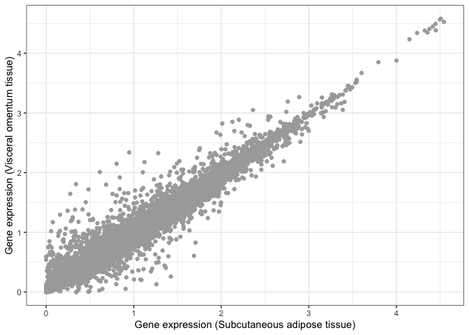<!-- -->

Visual inspection suggests that these two tissues are highly similar, but we need a statistical test that can tell us whether this is actually the case. For example, we can compute the Pearson correlation coefficient between both tissues and perform a test to infer whether this correlation is significantly different than zero.

The ggpubr library allows us to not only do this very easily, but also automatically add this information to a ggplot. All we need to do is add a new layer containing the results from a correlation test (`stat_cor()`), as follows:


```r
ggplot(gtex_log, aes(x=Adipose_Subcutaneous, y=Adipose_Visceral_Omentum)) +
  geom_point(color="darkgrey") +
  xlab("Gene expression (Subcutaneous adipose tissue)") +
  ylab("Gene expression (Visceral omentium adipose tissue)") +
  stat_cor() +
  theme_bw()
```

<!-- -->

We can now say for certain that both adipose tissues are significnatly and highly correlated.

Let's now repeat this, but comparing two tissues that we would expect to be very different from one another: subcutaneous adipose tissue and the hippocampus (i.e. neuronal tissue):


```r
ggplot(gtex_log, aes(x=Adipose_Subcutaneous, y=Brain_Hippocampus)) +
  geom_point(color="darkgrey") +
  xlab("Gene expression (Subcutaneous adipose tissue)") +
  ylab("Gene expression (Brain hippocampus)") +
  stat_cor() +
  theme_bw()
```

<!-- -->

This is where visualisation becomes extremely useful. The statistical test still tells us that both tissues are significantly correlated, albeit with a lower correlation magnitude. However, if we look at our scatter plot in more detail, we will see that there are now two groups of dots: genes that correlate in both tissues tend to form a straight line, while genes that do not correlate between tissues tend to locate at the edges, close to the X and Y axes.

This is probably due to some genes being essential and expressed by every tissue, with other genes being tissue-specific.

### Multivariate data

While visualising one or two variables at a time is useful, the power of high-throughput experiments like RNA-seq lies on the fact that they can measure thousands of variables at once. Thus, ideally we want to be able to include as much of this information as possilbe in our visualisations. This is made possible by multivariate data analysis techniques. These can be roughly divided into visualisation and dimensionality reduction tools.

#### Multivariate data visualisation

##### Heatmaps

Heatmaps are amongst the most powerful techniques for visualising multivariate data. They rely on 'tricking' the eye into perceiving color hues as a cointinuous variable. In this way, colour can be used to encode quantitative variables. For example, we can order colours following the rainbow spectrum or from "cold" (blue) to "hot" (red) colors. In addition, the rows and colours of a heatmap are grouped by similarity according to clustering algorithms, so as to draw the eye to the most evident patterns.

In functional genomics, heatmaps usually represent features (e.g. genes) as rows and samples (e.g. tissues) as columns of the heatmap, with each cell beling coloured according to the measured level of expression.

The most straightfoward way to generate heatmaps in R is by using the pheatmap library (which literally stands for Pretty Heatmap). For example, the code below generates a heatmap of all \>14,000 genes and 54 tissues in the GTEx study:


```r
pheatmap(gtex_log, show_rownames = F)
```

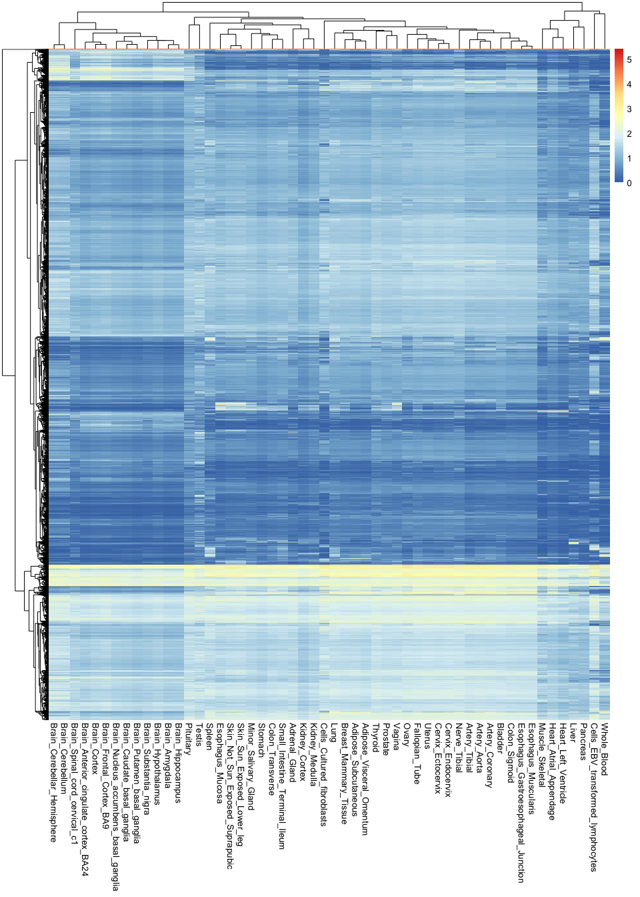<!-- -->

Note the shear amount of information encoded in a single image: there are over 760,000 observations in this plot.

These types of visualisations are useful for finding general patterns in the data. For example, you can see here that all brain tissues are grouped together and tend to have a group of very specific genes that are active in them. However, it is hard to recover any specific or finer details, because there is simply too much information in the image.

If we want to circumvent this issue, it is key to remember that not all variables are equally important: some genes are so essential that they will be expression everywhere at the same level, and are thus irrelevant for distinguishing between tissues. In contrast, some genes are extremely specific (e.g. only active in the brain), and these are the most useful for understanding tissue differences. Thus, it would be ideal to recover the most relevant variables while discarding any unnecessary information.

One way of doing this is by ranking genes according to how variable they are across tissues. If they don't vary at all, they probably are not very interesting. In contrast, if they show a high level of variability, it is likely that they are only being expressed in one or a handful of tissues.

Let's try this approach by calculating the variance of each gene across tissues. Variances measure the extent of variability of a variable. In this case, we can use the `rowVars()` function to compute these variances, which we will add as a new column to our `mean_expression` object:


```r
mean_expression$expr_var <- rowVars(as.matrix(gtex_log))
```

Let's now use ggplot to compare the average expression of each gene to its variance. Variance is represented here in the Y axis:


```r
ggplot(mean_expression, aes(x=log_mean_TPM, y=expr_var)) +
  geom_point(color="darkgrey") +
  xlab("Mean expression (log-TPM)") +
  ylab("Expression variance") +
  theme_bw()
```

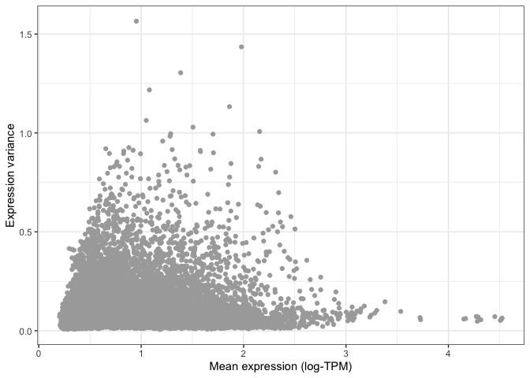<!-- -->

You can already see that the vast majority of genes have very low variance, and are thus likely to be uninformative.

This is even more apparent when we colour different areas of the plot based on the density of points, as shown below. This is particularly useful when looking at data set with a very large number of points, where it is difficult to distinguish which areas of the plot contain more data. To do so, we can ask ggplot to add a `geom_hex()` layer, which divides the plotting area into hexagons whose colour is proportional to the number of data points contained in that region:


```r
ggplot(mean_expression, aes(x=log_mean_TPM, y=expr_var)) +
  geom_hex(bins=50) +
  xlab("Mean expression (log-TPM)") +
  ylab("Expression variance") +
  theme_bw()
```

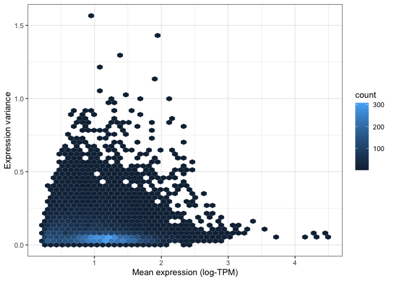<!-- -->

Both of the above visualisations make it clear that only a few hundreds genes are very variable across tissues, and we might want to explore these genes in more depth. For instance, let's take the top 100 most variable genes in the data set. We do this by using the "order" function to rank genes decreasingly by their variance. We then extract the first 100 genes in this ranked list:


```r
top_100_var_genes <- order(mean_expression$expr_var, decreasing = T)[1:100]
```

We can now use the pheatmap library to visualise these 100 variable genes across all tissues in the GTEx study:


```r
pheatmap(gtex_log[top_100_var_genes,], show_rownames = T, fontsize_row = 7.5)
```

<!-- -->

Note how much insights we gain by taking the most variable genes: now we not only know that brain tissues are grouped together, but we can also begin to understand why this is. We can see which genes tend to be active in the brain but not in any other tissues, and we can use this as a basis to understand the functions of each tissue.

##### Correlation plots

Another approach to understanding multivariate data is by using correlations. For example, which tissues are most similar to one another, and which are different? To answer this question, we can calculate the correlation between all pairwise combinations of tissues. The results from this is called a **correlation matrix**.

To compute a correlation matrix in R, you can simply use the `cor()` function: R will automatically detect that you are inputting a table, and will thus calculate a full correlation matrix between all columns of the table for you. Note that we are only using the top 1,000 most variable genes for this calculation. This is because, the more variables you use, the longer it will take for R to perform this computation. Since we already showed that most genes are not very informative, taking the top 1000 should be enough to differentiate tissues from each other.


```r
top_1000_var_genes <- order(mean_expression$expr_var, decreasing = T)[1:1000]
gtex_cormat <- cor(gtex_log[top_1000_var_genes,])
```

We now have a correlation matrix. Below you can see the first 5 rows and columns of this matrix. Note how all values in the diagonal are 1, since we are comparing a tissue to itself, and thus the values are identical. Note also that the matrix is symmetric with respect to this diagonal. This is because correlations are the same regardless of the order of the variables (i.e. the correlation value is the same whether you compare adrenal gland to coronary artery or coronary artery to adrenal gland).


```r
gtex_cormat[1:5,1:5]
```

```
##                          Adipose_Subcutaneous Adipose_Visceral_Omentum
## Adipose_Subcutaneous                1.0000000                0.9563809
## Adipose_Visceral_Omentum            0.9563809                1.0000000
## Adrenal_Gland                       0.6810204                0.7059080
## Artery_Aorta                        0.8249191                0.8087838
## Artery_Coronary                     0.8904570                0.8767685
##                          Adrenal_Gland Artery_Aorta Artery_Coronary
## Adipose_Subcutaneous         0.6810204    0.8249191       0.8904570
## Adipose_Visceral_Omentum     0.7059080    0.8087838       0.8767685
## Adrenal_Gland                1.0000000    0.6493837       0.6772025
## Artery_Aorta                 0.6493837    1.0000000       0.9635597
## Artery_Coronary              0.6772025    0.9635597       1.0000000
```

We can visualise this correlation matrix as a heatmap. Note that now the colours of the heatmap represent the correlation coefficient between pairs of tissues:


```r
pheatmap(gtex_cormat, fontsize = 8)
```

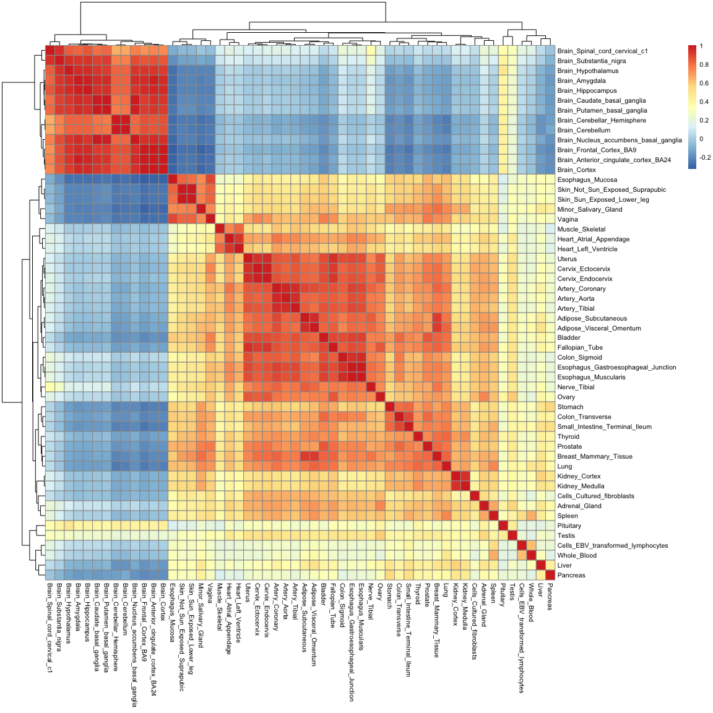<!-- -->

While you are only seeing around 2900 variables in this plot (which is the size of the correlation matrix), the information contained in it is really a summary of 54,000 observations. Note how you can recover a lot of structure as well: we can now see how tissues in the gastrointestinal tract are similar to one another, and how mucosal tissues form a distinct group.

##### Distance matrices and hierarchical clustering

Just like tissues can be compared to each other using correlations, they can also be compared using "distances". If we think of each gene as axes or variables in space, distances literally tell us how far away two tissues are from each other in such a space.

In R, we can calculate distances using the `dist()` function. Just like with the correlation matrix above, we will restrict this calculation to the top 1,000 most variable genes only, so as to reduce the time it takes to do the computation. There are many types of distances. Here we will simply use the "Euclidean" distance, which means the length of a straight line connecting the two tissues of interest. Note that R will automatically calculate the distances between all pairwise combinations of tissues in a single line of code:


```r
gtex_dist <- dist(t(gtex_log[top_1000_var_genes,]), method = "euclidean")
```

The resulting **distance matrix** is shown below. Again, the matrix is symmetric (since distance estimates are independent of variable order) and the diagonal is made of zeros, since by definition the distance of a point to itself is zero (they occupy the same position in space).


```r
as.matrix(gtex_dist)[1:5,1:5]
```

```
##                          Adipose_Subcutaneous Adipose_Visceral_Omentum
## Adipose_Subcutaneous                 0.000000                 8.267723
## Adipose_Visceral_Omentum             8.267723                 0.000000
## Adrenal_Gland                       21.902005                20.831643
## Artery_Aorta                        17.810502                18.364102
## Artery_Coronary                     13.965275                14.532707
##                          Adrenal_Gland Artery_Aorta Artery_Coronary
## Adipose_Subcutaneous          21.90200    17.810502       13.965275
## Adipose_Visceral_Omentum      20.83164    18.364102       14.532707
## Adrenal_Gland                  0.00000    25.225716       23.993467
## Artery_Aorta                  25.22572     0.000000        8.274076
## Artery_Coronary               23.99347     8.274076        0.000000
```

Just as with the correlation matrix, distance matrices can also be visualised as heatmaps:


```r
pheatmap(as.matrix(gtex_dist))
```

<!-- -->

You'll notice that this heatmap is essentially the opposite of the correlation heatmap: a high correlation equates to a small distance.

Distances are not only useful for visualisation though: they enable us to cluster tissues into groups according to how far away they are from each other. One simple method to do this is **hierarchical clustering**, which puts tissues into a "family tree" (or dendrogram, which is the correct term) according to how similar they are to each other. The `hclust()` function allows us to seamlessly perform hierarchical clustering in a distance matrix:


```r
gtex_hclust <- hclust(gtex_dist)
```

We can then use base R's plotting function to visualise the resulting dendrogram:


```r
plot(
  gtex_hclust
)
```

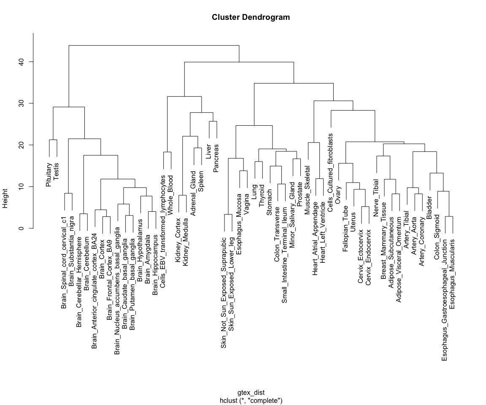<!-- -->

Note how tissues are arranged into clear blocks that make biological sense: all brain samples are together, with the cerebellum forming a separate sub-branch; GI tract tissues tend to form a separate group, as do arterial tissues and mucosal tissues; etc...

#### Dimensionality reduction

Finally, we will explore a technique for summarising the \>14,000 dimensions in the GTEx data into a set of 2 to 3 variables, a technique called dimensionality reduction. We will focus on one such technique in particular: **Principal Component Analysis (PCA)**

##### PCA

PCA is a technique for identifying the most important axes of variation in a multivariate data set. For a review on the principles of PCA you can refer to the associated slides.

PCA can be performed using the `prcomp()` function in R, as shown below. Just like in the previous section, we perform our analysis using only the top 1000 most variable genes. Note how we can then extract different outputs of the algorithm, such as the principal components themselves (`$x`), as well as the amount of variability explained by each of the components (`$sdev`):


```r
gtex_pcs <- prcomp(t(gtex_log[top_1000_var_genes,]))

# Fetching coordinates and proportion of variance explained for each component
gtex_pc_coords <- data.frame(gtex_pcs$x)
pc_vars <- gtex_pcs$sdev^2/sum(gtex_pcs$sdev^2)*100
```

Principal components are ordered by importance, and usually looking at the first few is enough to get a good summary of the whole structure of a data set. Let's assess how much variance is captured by each component in the GTEx data:


```r
plot(pc_vars, type = "b", ylab="Variance explained (%)", xlab="Principal component")
```

<!-- -->

Note how looking at the first two components gives us close to 60% of the information contained in the data!

Let's thus look at these first two components by plugging them into a ggplot function:


```r
ggplot(gtex_pc_coords, aes(x=PC1, y=PC2)) +
  geom_point(size=5) +
  theme_bw()
```

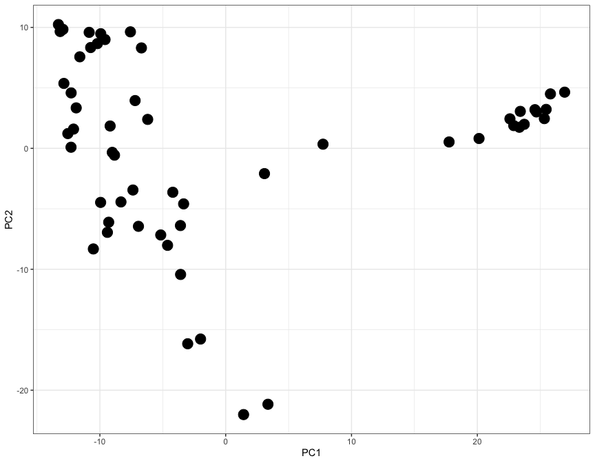<!-- -->

Here each dot represents a tisue, and the X and Y axes (PC1 and PC2) contain information from thousands of genes, all compressed into just two axes.

Let's use the ggrepel library to add labels and colours to each dot, so that we can undenrstand which tissue is which:


```r
gtex_pc_coords$tissue <- colnames(gtex_log)
ggplot(gtex_pc_coords, aes(x=PC1, y=PC2)) +
  geom_point(aes(color=tissue), size=5) +
  geom_label_repel(aes(fill=tissue, label=tissue), size=3, max.overlaps = 17) +
  theme_classic() +
  theme(legend.position = "none")
```

<!-- -->

While only 54 dots are shown on this plot, the graph is a summary of 54,000 observations. This is clear from the level of detail that this plot contains: note how brain tissues form a group on the right-hand side, while arterial tissues group together on the top left corner. In addition, lymphoid cells (whole blood and transformed lymphocytes) separate at the bottom of the plot, as do the pancreas and the liver. It is clear how the position of tissues in this visualisation really is the summary of thousands of different gene expression observations.

## Conclusion

In this tutorial we have learned how to use ggplot and other associated packges to visualise multivariate data. We did this by looking at a specific example of RNA-seq data derived from the GTEx project.

## Session details


```r
sessionInfo()
```

```
## R version 4.1.0 (2021-05-18)
## Platform: aarch64-apple-darwin20 (64-bit)
## Running under: macOS Big Sur 11.5.2
## 
## Matrix products: default
## BLAS:   /Library/Frameworks/R.framework/Versions/4.1-arm64/Resources/lib/libRblas.dylib
## LAPACK: /Library/Frameworks/R.framework/Versions/4.1-arm64/Resources/lib/libRlapack.dylib
## 
## locale:
## [1] en_GB.UTF-8/en_GB.UTF-8/en_GB.UTF-8/C/en_GB.UTF-8/en_GB.UTF-8
## 
## attached base packages:
## [1] stats     graphics  grDevices utils     datasets  methods   base     
## 
## other attached packages:
##  [1] hexbin_1.28.2      ggrepel_0.9.1      ggpubr_0.4.0       pheatmap_1.0.12   
##  [5] reshape2_1.4.4     matrixStats_0.62.0 forcats_0.5.1      stringr_1.4.0     
##  [9] dplyr_1.0.7        purrr_0.3.4        readr_2.1.2        tidyr_1.2.0       
## [13] tibble_3.1.8       ggplot2_3.3.6      tidyverse_1.3.2   
## 
## loaded via a namespace (and not attached):
##  [1] httr_1.4.2          sass_0.4.2          jsonlite_1.8.0     
##  [4] carData_3.0-5       modelr_0.1.8        bslib_0.4.0        
##  [7] assertthat_0.2.1    highr_0.9           googlesheets4_1.0.0
## [10] cellranger_1.1.0    yaml_2.3.5          pillar_1.8.0       
## [13] backports_1.4.1     lattice_0.20-44     glue_1.6.2         
## [16] digest_0.6.29       RColorBrewer_1.1-2  ggsignif_0.6.3     
## [19] rvest_1.0.2         colorspace_2.0-2    htmltools_0.5.3    
## [22] plyr_1.8.6          pkgconfig_2.0.3     broom_0.7.12       
## [25] haven_2.4.3         scales_1.1.1        tzdb_0.2.0         
## [28] googledrive_2.0.0   farver_2.1.0        generics_0.1.0     
## [31] car_3.1-0           ellipsis_0.3.2      cachem_1.0.6       
## [34] withr_2.4.2         cli_3.3.0           magrittr_2.0.3     
## [37] crayon_1.5.1        readxl_1.3.1        evaluate_0.16      
## [40] fs_1.5.2            fansi_0.5.0         rstatix_0.7.0      
## [43] xml2_1.3.3          tools_4.1.0         hms_1.1.1          
## [46] gargle_1.2.0        lifecycle_1.0.0     munsell_0.5.0      
## [49] reprex_2.0.1        compiler_4.1.0      jquerylib_0.1.4    
## [52] rlang_1.0.4         grid_4.1.0          rstudioapi_0.13    
## [55] labeling_0.4.2      rmarkdown_2.14      gtable_0.3.0       
## [58] abind_1.4-5         DBI_1.1.2           R6_2.5.1           
## [61] lubridate_1.8.0     knitr_1.39          fastmap_1.1.0      
## [64] utf8_1.2.2          stringi_1.7.8       Rcpp_1.0.7         
## [67] vctrs_0.3.8         dbplyr_2.1.1        tidyselect_1.1.1   
## [70] xfun_0.32
```
