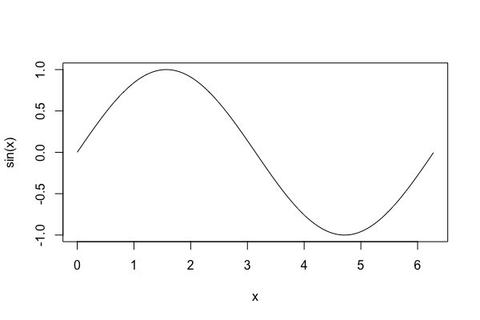
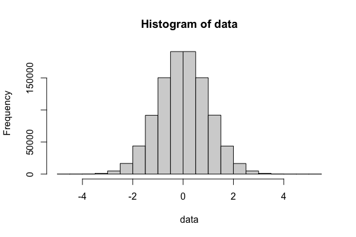

# R and RStudio

A great deal of data analysis work is done in [R](https://www.r-project.org) - you'll need this
installed. The recommended way is to work with [RStudio](https://www.rstudio.com), but it's also
possible to use directly in the command-line, or via a Jupyter notebook and so on.

### Installing R directly

* R is downloaded from the 'Comprehensive R Archive Network'. First, pick [an appropriate
  mirror](https://cran.r-project.org/mirrors.html) and then click the appropriate download button.
  This will guide you to install R - you want the 'base' version. (R can be installed in other ways
  too - e.g. it's also possible to have [conda](CONDA.md) install R if you prefer - but this way is easiest.)

* `Rstudio` can be downloaded from [rstudio.com](https://www.rstudio.com). Find the [Rstudio product
  page](https://www.rstudio.com/products/rstudio/) and click 'Download Rstudio Desktop'.

Install both these packages (default options) and then try running Rstudio. You should see a window
with a few panes showing R's default startup text, a file browser and some information on your R
environment (which means the variables you have in your session.)

### Trying it out

For example to test it, let's try a few things.  For example we could create a variable:

```
a = "Hello, this is a string"
```

(You should see the variable `a` appear in the `Environment` pane.)

Or make a simple plot:

```
x = seq( from = 0, to = 2*pi, by = 0.01 )
plot( x, sin(x), type = 'l' )
```



Or generate and plot a million samples from a Gaussian distribution:

```
data = rnorm( 1000000, mean = 0, sd = 1 )
hist(data)
```



Congratulations!  You now have R installed.  

### Next steps

A good thing to do is to [install tidyverse](tidyverse.md).
