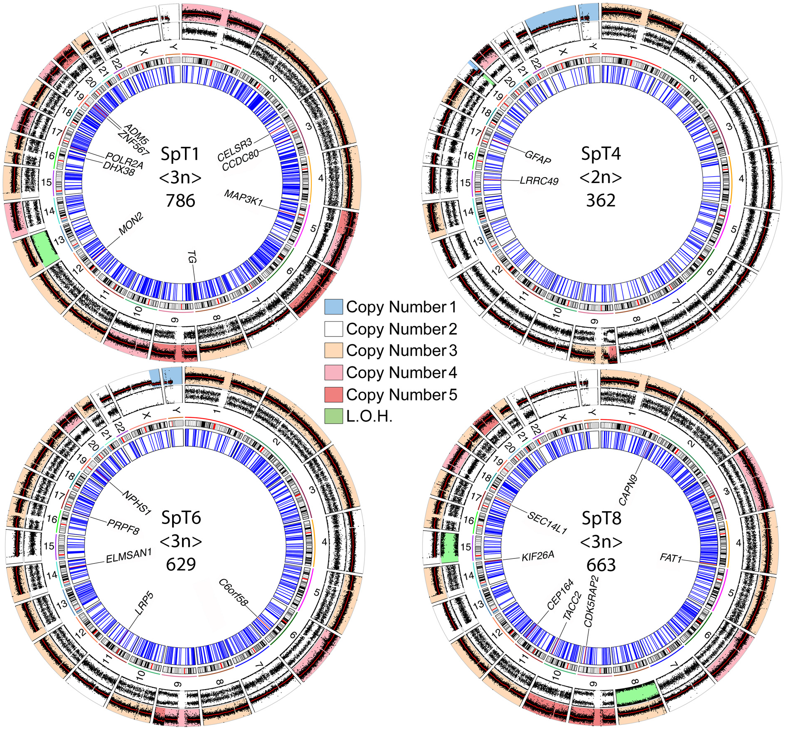
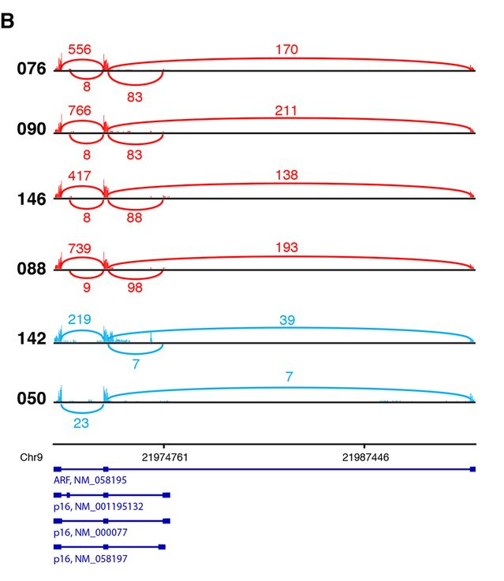
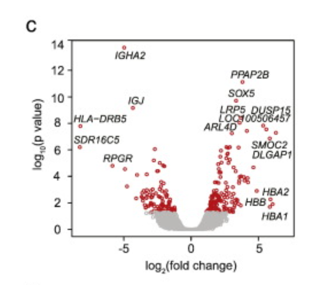
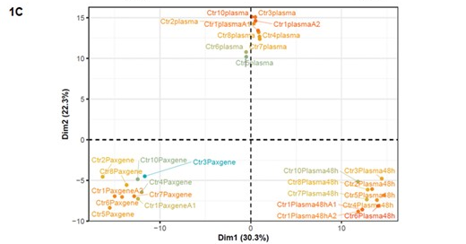
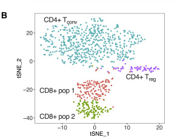
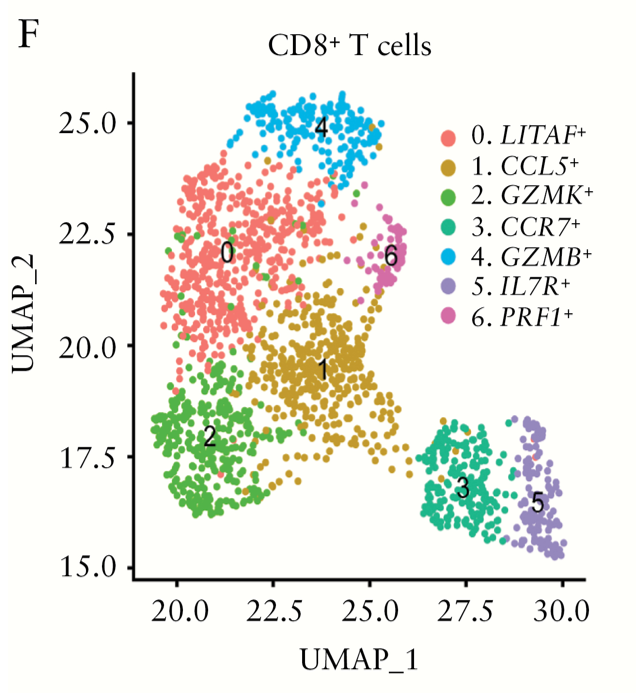
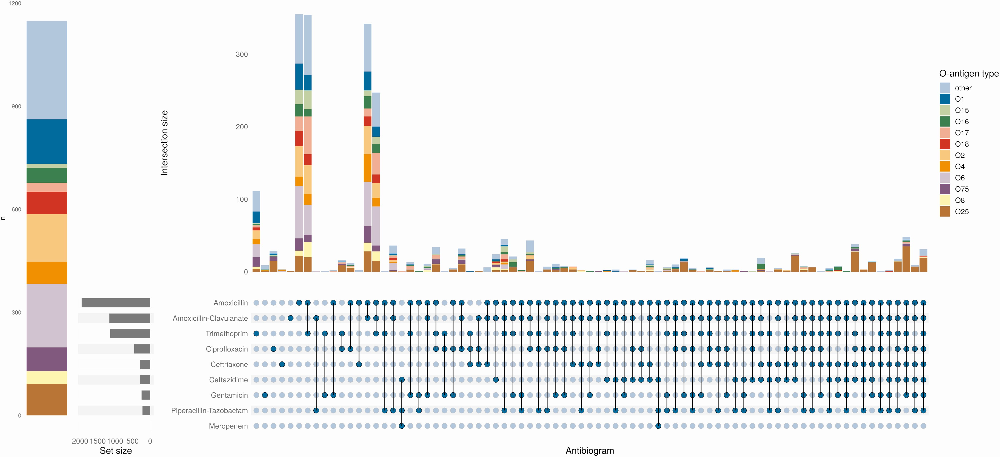

# Data Visualisation Tutorial

Authors: Ben Wright, Helen Lockstone

Bioinformatics Core

## Tutorial Plan

Tutorial groups: 4 (hopefully)

Each group is given one of these sets of plots to look at and discuss. Each set comes with some 
questions to think about. In the Friday 
session, each group will give a short, informal presentation about their group of plots.

Please co-ordinate to make sure no two groups cover the same set of plots!

In each section there are some example plots for that type, followed by some questions to consider 
about them. Try to answer those questions based on inspection of the plot and your own knowledge
first. The next section has a link to more information on each type of plot (some of these are not 
specific to genomics), but please try to answer the questions before following the link for answers.
The answers to these questions might be not be the same for every plots in a group!

Note that the names the sets have been given here aren't formal classifications of plot types, just 
a way of showing what the theme is for each set.

## Set 1: Locus-centric Plots

### Example Plots

From [https://doi.org/10.1182/blood-2017-02-769869](https://doi.org/10.1182/blood-2017-02-769869)

From [https://doi.org/10.1371/journal.pone.0178169](https://doi.org/10.1371/journal.pone.0178169)

### Questions to Consider

- What types of experiment would produce this data?
- What channels are used in these plots (as per CM4.4 data visualisation theory)?
- What data is shown in each of those channels?
- What conclusions can you draw from these particular plots?
- What might these plots look like when the data quality is good and there are significant findings?
- What might these plots look like when the data quality is good but there are *no* significant findings?

### Plot Explanations

- [Manhattan Plot](https://www.sciencedirect.com/topics/biochemistry-genetics-and-molecular-biology/manhattan-plot)
- [Circos Plot](https://www.ncbi.nlm.nih.gov/pmc/articles/PMC2752132/)

### R Packages

## Set 2: Gene-centric Plots

### Example Plots

From [https://doi.org/10.1128/mBio.02079-16](https://doi.org/10.1128/mBio.02079-16)

Heatmap

From [https://doi.org/10.1016/j.clim.2015.05.020](https://doi.org/10.1016/j.clim.2015.05.020)

### Questions to Consider

- What types of experiment would produce this data?
- What channels are used in these plots (as per CM4.4 data visualisation theory)?
- What data is shown in each of those channels?
- What conclusions can you draw from these particular plots?
- What might these plots look like when the data quality is good and there are significant findings?
- What might these plots look like when the data quality is good but there are *no* significant findings?

### Plot Explanations

- [Shashimi Plot](https://ui.adsabs.harvard.edu/abs/2013arXiv1306.3466K/abstract)
- [Heatmap](https://chartio.com/learn/charts/heatmap-complete-guide/)
- [Volcano Plot](https://training.galaxyproject.org/training-material/topics/transcriptomics/tutorials/rna-seq-viz-with-volcanoplot/tutorial.html)

### R Packages

## Set 3: Dimensional Reduction Plots

### Example Plots

From [https://doi.org/10.1093/ndt/gfaa142.P1611](https://doi.org/10.1093/ndt/gfaa142.P1611)

From [https://doi.org/10.1016/j.celrep.2020.108661](https://doi.org/10.1016/j.celrep.2020.108661)

From [https://doi.org/10.1093/ecco-jcc/jjaa054](https://doi.org/10.1093/ecco-jcc/jjaa054)

### Questions to Consider

- What types of experiment would produce this data?
- What channels are used in these plots (as per CM4.4 data visualisation theory)?
- What data is shown in each of those channels?
- What sort of 'groups' might be found in these plots?
- What do the values on the axes represent?
- What do the distances between points represent?
 
### Plot Explanations

- [PCA Plot](https://bioturing.medium.com/how-to-read-pca-biplots-and-scree-plots-186246aae063)
- [tSNE Plot](https://distill.pub/2016/misread-tsne/)
- [UMAP Plot](https://umap-learn.readthedocs.io/en/latest/plotting.html)

### R Packages

## Set 4: Significance-centric Plots

### Example Plots

From [https://doi.org/10.1016/j.clim.2015.05.020](https://doi.org/10.1016/j.clim.2015.05.020)

From [https://doi.org/10.1093/cid/ciab006](https://doi.org/10.1093/cid/ciab006)

From [https://doi.org/10.1093/ndt/gfaa142.P1611](https://doi.org/10.1093/ndt/gfaa142.P1611)

### Questions to Consider

- What types of experiment would produce this data?
- What channels are used in these plots (as per CM4.4 data visualisation theory)?
- What data is shown in each of those channels?
- What conclusions can you draw from these particular plots?
- What might these plots look like when the data quality is good and there are significant findings?
- What might these plots look like when the data quality is good but there are *no* significant findings?

### Plot Explanations

- [Venn Diagram](https://www.lucidchart.com/pages/tutorial/venn-diagram)
- [UpSet Plot](https://upset.app/)
- [Box & Whisker Plot](https://www.tableau.com/data-insights/reference-library/visual-analytics/charts/box-whisker)

### R Packages